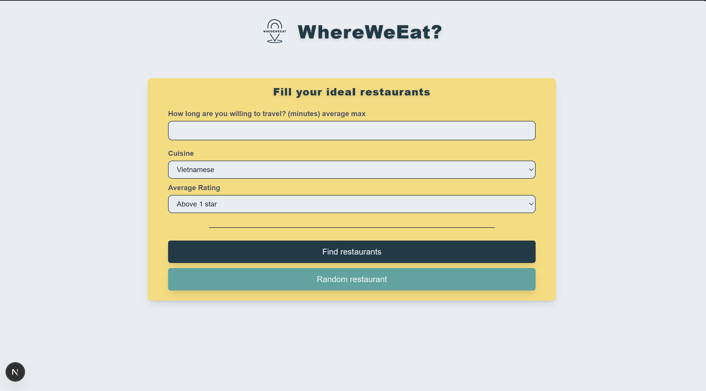

# WhereWeEat 🍽️

*Can't decide where to eat? Let WhereWeEat decide for you.*

## Inspiration
This started from the most ordinary problem I could think of: nobody can ever agree on where to eat. You scroll for ten minutes, get overwhelmed, and end up at the same place as always. I wanted to take that little daily decision and make it fast, and honestly, a bit more fun. That's how WhereWeEat came about. You tell it roughly what you want, and it either shows you real places nearby or, if you can't be bothered choosing, it picks one for you and makes you scratch a card to find out where you're going.

## What it does
WhereWeEat works in two ways depending on your mood. If you want control, you fill in a few preferences like how far you're willing to travel, the kind of cuisine, and a minimum rating, and it gives you a list of real restaurants around you. Tap any of them and the route appears on a live map, along with how long it takes and how far it is by walking, biking, or driving.

If you genuinely can't decide, there's the random button. It surprises you with a single restaurant hidden behind a scratch card, so you actually have to scratch it off to reveal where you're eating. It still pays attention to your preferences if you set any, so the surprise is never completely random.

Either way you land on a place with its route, its travel time, and a link out to Google Maps directions so you can just go.

## How I built it
The frontend is a Next.js app using React, TypeScript, and Tailwind CSS. I deliberately kept it simple, because the point of this project for me was to spend my energy on the backend and the data side rather than on making a fancy interface.

The backend is a FastAPI service, and it's really the brain of the whole thing. It talks to a few different services and stitches their answers together into one clean result. It pulls restaurant information from the Foursquare Places API, works out distance and travel time through OpenRouteService, and draws everything on a map using Leaflet with OpenStreetMap tiles.

The part I'm happiest with is the logic in the middle. The backend turns a "maximum travel time" into a search radius depending on how you're travelling, filters the nearby places by straight line distance so it doesn't waste calls, attaches a rating, and then either returns the list or randomly picks one. I kept a small normalization layer so that every source gets turned into the same shape, which means I can swap a provider out later without breaking the rest of the app. The frontend is deployed on Vercel with the backend hosted separately.

## Third-party services and APIs
Everything WhereWeEat uses runs on a free tier or an open license, and here is what each one does. Restaurant data comes from the Foursquare Places API on its free tier. Routing, meaning the distance and travel time for each transport mode, comes from OpenRouteService using a free API key. The map itself uses OpenStreetMap tiles and data, which is © OpenStreetMap contributors under the ODbL license, and the attribution is shown on the map as the license requires. The user's location comes from the browser's built in Geolocation API.

On the frontend I used Next.js, React, and Tailwind CSS, with Leaflet and react-leaflet for the map, react-scratchcard-v2 for the scratch card reveal, and react-icons, Heroicons, and react-loading-indicators for the smaller touches. On the backend I used FastAPI with Uvicorn, httpx as the async HTTP client for calling those APIs, and Pydantic with python-dotenv for models and configuration. Hosting is on Vercel.

## Challenges I ran into
The biggest surprise was how many things sit behind a paywall. Google Maps needs billing set up before it does anything useful, and even Foursquare's rating and price fields turned out to be premium. That forced me to rebuild the whole data layer around genuinely free sources, which was frustrating at the time but honestly made the project better.

The other recurring battle was with React state and timing. I kept getting caught reading a value right after setting it, which meant the modal would open before its data arrived, coordinates would come through as null, and at one point the random button fired a whole pile of requests at once. Learning to use the value I already had instead of the state that hadn't updated yet cleared up a whole family of bugs. There were smaller fights too, like OpenRouteService returning coordinates in the opposite order to what Leaflet expects, which kept sending my routes into the ocean until I fixed the order in one place, and the usual pain of getting a map library to behave inside Next.js.

## Accomplishments that I'm proud of
I'm proud that it actually works end to end and costs nothing to run, since it sits entirely on free APIs. The scratch card reveal is my favourite part, because it takes a plain recommendation and turns it into a small moment of fun. I'm also proud of how the backend is organised, with the search, routing, and recommendation logic kept separate so it's easy to build on, and of getting the layout to reflow properly so it still feels right on a phone.

## What I learned
This was my real introduction to backend engineering. I learned how to build a FastAPI service, how to integrate and debug third-party APIs, how to handle geolocation and asynchronous flows, and how to design an actual recommendation pipeline instead of another CRUD app. On the frontend I finally understood how React state and async behaviour really work, mostly by getting them wrong first. I also picked up the practical side of shipping something, like environment variables, CORS, and deploying to Vercel.

## A note on how I built it
I built this as a learning project and did the coding myself, but I leaned on AI assistants as guides along the way. Claude (through Claude Code) and GitHub Copilot acted more like mentors than authors. They explained concepts I hadn't met before, pointed me to the right documentation, reviewed what I wrote, and helped me track down bugs, while I stayed the one making the decisions and typing the code. A lot of what I learned came from that back and forth.

## What's next for WhereWeEat
The direction I most want to take next is the AI layer this project was always meant to have. I'd like to analyse review text with scikit-learn to pick up sentiment and opinions about things like food, service, price, atmosphere, and waiting time, and then build a small Transformer from scratch in PyTorch that can summarise a pile of reviews into a short, readable verdict. Those signals would then feed into the recommendation score. Beyond that I want to add a PostgreSQL cache so the app stops re-hitting the APIs, tighten the filtering using real routing rather than straight line distance, and let people save their favourites.

## Try it out
The live demo is at _add your Vercel URL here_ and the source is at _add your GitHub URL here_.
